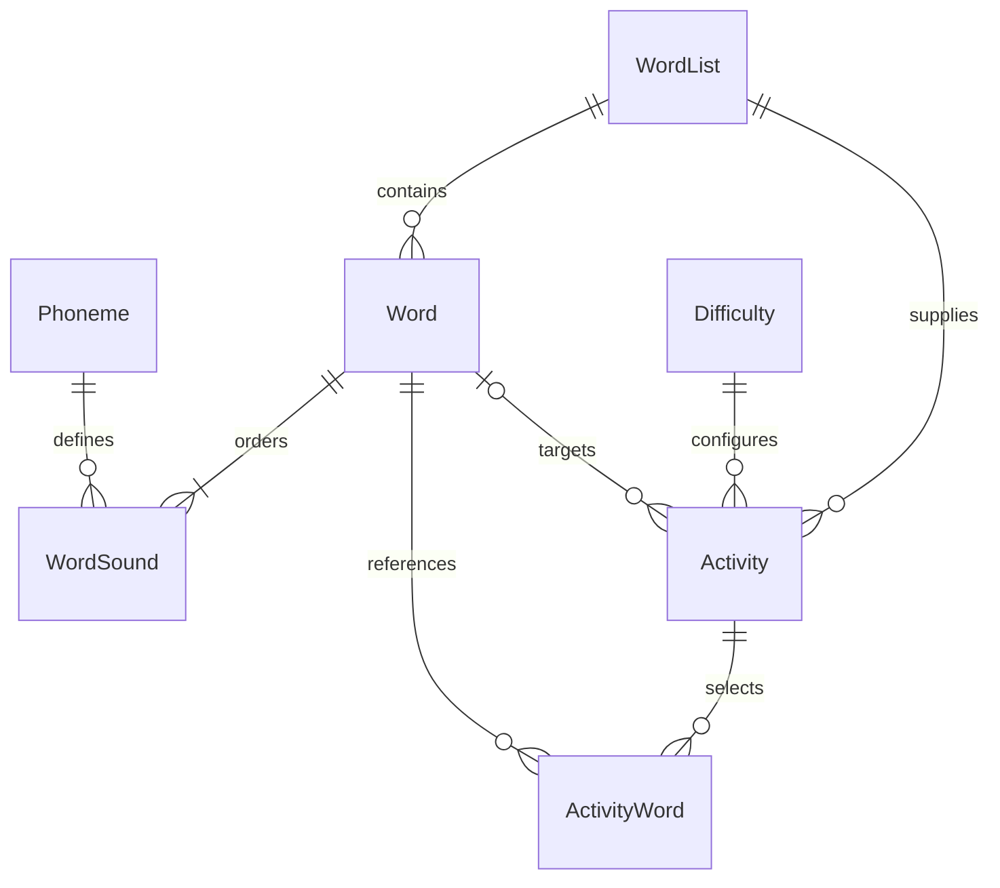

# Assessment 2 architecture

The original Next.js App Router frontend now communicates with same-origin HTTP route handlers. Server-only modules use Prisma to access SQLite. Shared game functions provide the same rules to the interactive preview and the server-generated HTML download.

## Data model



| Model        | Stored information and constraints                                                                                       |
| ------------ | ------------------------------------------------------------------------------------------------------------------------ |
| WordList     | Name, description, timestamps and related words/configurations                                                           |
| Word         | English spelling, a case-normalized duplicate key, hint and list ID; English key unique within a list                    |
| Phoneme      | A complete Unicode symbol, English label, example word and consonant/vowel category; symbol unique                       |
| WordSound    | Word ID, position and phoneme ID; composite primary key preserves order and repeated phonemes                            |
| Difficulty   | Gentle/standard/challenge identifiers, labels, guess limits, suggested grid size and allowed directions                |
| Activity     | Type, title, instructions, list, difficulty, Wordle target, hints, labels, theme, dimensions, random seed and timestamps |
| ActivityWord | Ordered Word Search word selections with unique membership and position per activity                                     |
| SeedState    | Marker ensuring seed data is applied once and teacher-deleted entries are not resurrected                                |

For example, `tʃ ɪ n` is stored as three ordered WordSound rows referencing three complete symbols. JavaScript string length never determines the number of game tiles. Repeated sounds reference the same phoneme from separate positions. Input is trimmed and Unicode-normalized; Latin `g` is canonicalized to IPA `ɡ` to match the supplied corpus.

## Request and generation workflow

1. The library requests stored lists and the phoneme/difficulty catalog. Editors send JSON to the relevant API.
2. Zod validates types, lengths, token arrays and settings. Server logic verifies referenced records and uses transactions for related updates.
3. The builder loads words by list ID. Its interactive preview uses these retrieved records plus the draft settings.
4. **Save & generate HTML** first persists the configuration and receives its ID. It then requests `/api/activities/{id}/html`.
5. The export endpoint loads current words, cues, difficulty and saved settings in a consistent database transaction. It revalidates the activity and generates the attachment from that data. A request cannot override the export by supplying unsaved settings.
6. The downloaded HTML embeds all data, styles and game code. It makes no runtime API requests and remains usable offline.

Editing a stored word or hint affects future exports. Previously downloaded files remain independent snapshots. A seeded puzzle arrangement is repeatable while its selected phoneme content, dimensions, directions and seed stay unchanged.

## HTTP API

All responses are uncached. Successful creation returns 201, updates/reads return 200 and deletion returns 204. Errors return JSON with an `error` message and, for field validation, a `fields` object.

| Route                       | Methods          | Purpose                                                                      |
| --------------------------- | ---------------- | ---------------------------------------------------------------------------- |
| `/health`                   | GET              | Query database tables; 200 when connected and migrated, 503 when unavailable |
| `/api/catalog`              | GET              | Phonemes and stored difficulty presets                                       |
| `/api/lists`                | GET, POST        | Read summaries or create a list                                              |
| `/api/lists/{id}`           | GET, PUT, DELETE | Retrieve words, edit list metadata or delete an unused list                  |
| `/api/lists/{id}/words`     | POST             | Add a word to a list                                                         |
| `/api/words/{id}`           | GET, PUT, DELETE | Read, edit or delete a word                                                  |
| `/api/phonemes`             | GET, POST        | Read the symbol catalog or create a symbol                                   |
| `/api/phonemes/{id}`        | GET, PUT, DELETE | Read, edit or delete a phoneme and its cues                                  |
| `/api/activities`           | GET, POST        | Read summaries or create a configuration                                     |
| `/api/activities/{id}`      | GET, PUT, DELETE | Retrieve, replace or delete a saved configuration                            |
| `/api/activities/{id}/html` | GET              | Download a playable HTML attachment generated from stored data               |

Example list body:

```json
{ "name": "Affricate practice", "description": "Three-sound words" }
```

Example word body (POST to a saved list's `/words` route):

```json
{
  "english": "chin",
  "phonemes": ["tʃ", "ɪ", "n"],
  "hint": "A part of your face"
}
```

Example activity body (replace the IDs with returned database IDs):

```json
{
  "type": "wordle",
  "title": "Affricate practice",
  "instructions": "Build the word one sound at a time.",
  "difficulty": "gentle",
  "listId": "<saved-list-id>",
  "wordId": "<saved-word-id>",
  "wordIds": [],
  "hints": true,
  "labels": true,
  "theme": "light",
  "seed": 42,
  "rows": 10,
  "cols": 10
}
```

For Word Search, use `type: "word-search"`, `wordId: ""` and one to twelve saved IDs in `wordIds`. PUT requests use the same complete body shape as creation. Difficulty presets are read-only catalog records; each activity stores the teacher's chosen preset. Word content, phonemes, lists and configurations have full CRUD.

## Validation and consistency

- JSON requests are limited to 32 KiB and require `application/json`. Malformed JSON returns 400; oversized requests return 413 and incorrect content types return 415.
- Mutating requests reject a foreign browser Origin with 403. The check uses the request Host rather than the internal Next.js bind hostname. An explicitly configured `APP_ORIGIN` can pin the expected origin for a reviewed proxy deployment.
- Missing records return 404. Duplicate English words within the same list and duplicate phoneme symbols return 409.
- Word input must contain 1–12 separate recognized phonemes; a new symbol must first be added to the phoneme library. Wordle targets require 2–8 sounds.
- Search selections must belong to their list, have distinct phoneme sequences and fit the selected grid. The server runs the actual placement algorithm before saving.
- Updating a word rebuilds its ordered sounds and revalidates every affected activity in one transaction. An edit that would invalidate an activity is rolled back.
- Foreign keys restrict deletion of words, lists and phonemes that are in use. The UI explains how to remove the dependency. Deleting an unused list cascades to its words and positions; deleting an activity cascades only to its selections.
- HTML titles/instructions are escaped and embedded JSON escapes script-closing characters. Server-generated errors do not expose stack traces to the browser.

## Components and accessibility

Library editors, confirmation dialogs and form fields are reusable components. The builder separates configuration controls from the sandboxed student preview. API helpers centralize request errors. Shared game code prevents preview/export rule divergence.

Forms have explicit labels, required fields and inline errors; delete dialogs support keyboard focus handling. Navigation includes a compact menu. Layouts adapt to small screens, tables scroll within their panel and preview controls include a phone-width view. Feedback uses text and symbols alongside color, phoneme cues work on focus as well as hover, and games are untimed. The default corpus follows the supplied HCE transcription conventions; teachers can adapt cues for their students.

## Deployment and trade-offs

SQLite is suitable for this small, single-server classroom project and keeps setup reproducible without an external database service. It provides real persistence and relational integrity, but is not a shared database for multiple container replicas. A future multi-user deployment should add accounts, per-teacher authorization, backups, conflict handling, pagination and a database such as PostgreSQL.

The multi-stage Dockerfile builds Next.js standalone output and runs the server as the non-root `node` user. It retains the Prisma CLI in production so the startup script can apply committed migrations; this increases image size but makes the lab setup self-contained. A named Docker volume stores `/app/data/studio.db`. Seed initialization is transactional and runs only once. The health endpoint queries the schema rather than returning a hard-coded success.

The application does not collect student responses, provide phonetic speech recognition or grade secure examinations. Offline activities contain their answers by design. Browser preference cookies are separate from the database and contain interface preferences, not classroom word lists.
